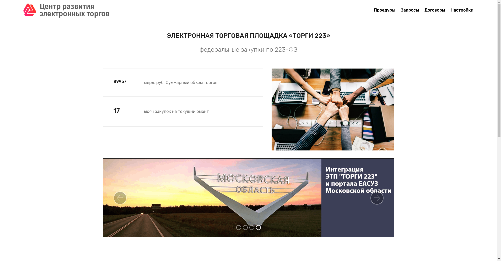
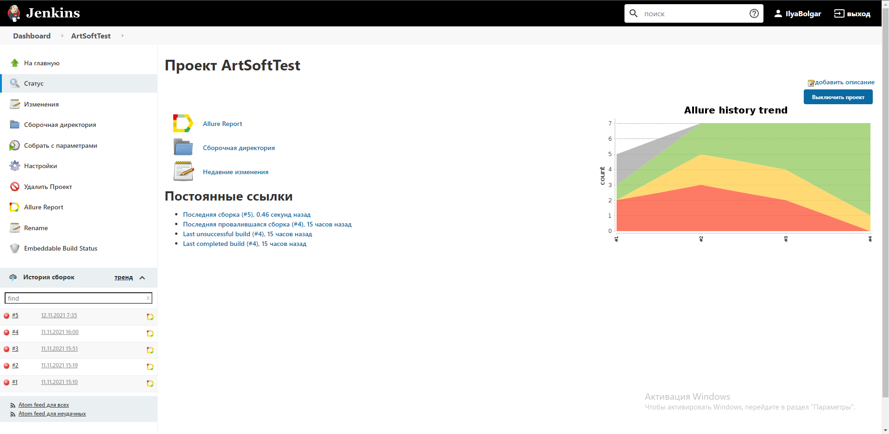
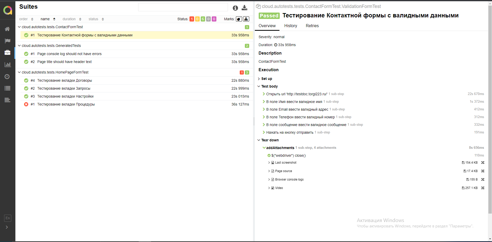
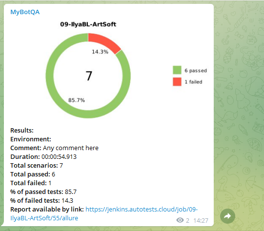

## Автотесты для сайта http://testdoc.torgi223.ru/


## Проект запускается в CI Jenkins


# Для запуска тестов используются следующие команды

### Запуск тестов, когда файл remote.properties не заполнен:

* browser (default chrome)
* browserVersion (default 89.0)
* browserSize (default 1920x1080)
* remoteDriverUrl (указываем логин, пароль и адрес удаленного сервера, где будут проходить тесты )
* videoStorage (параметр для сохранения видео)
* threads (количество потоков)
```bash
gradle clean -DremoteDriverUrl=https://%s:%s@selenoid.autotests.cloud/wd/hub/ -DvideoStorage=https://selenoid.autotests.cloud/video/ -Dthreads=1 test
```

Запуск тестов, когда файл remote.properties заполнен:
```bash
gradle clean test
```

## Отчет в Allure


Команда для генерация отчета Allure:
```bash
allure serve build/allure-results
```
### К каждому тесту прикладываются:

* Скриншоты
* Исходники страницы
* Логи браузера
* Видео


## Отчет о прохождении тестов отправляется в телеграм 


## Видеотчет теста "Контактная форма"


