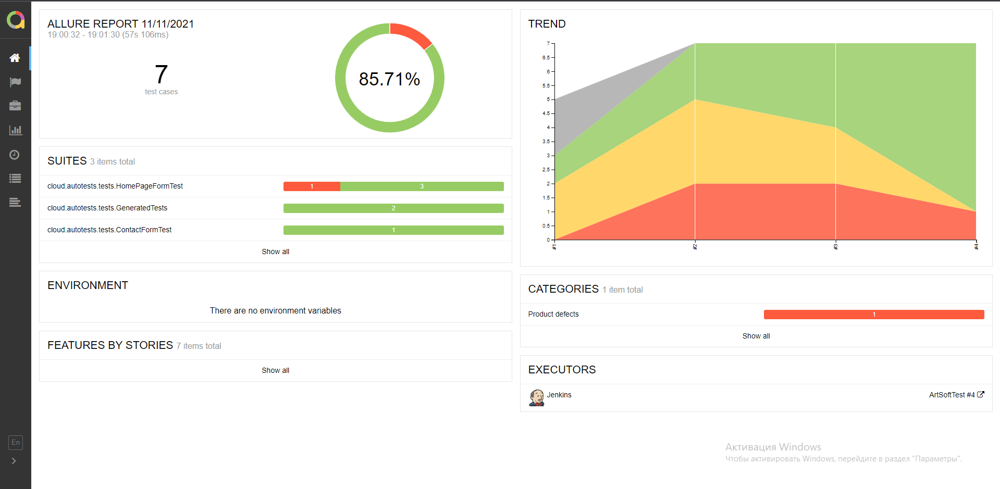

## Автотесты для сайта http://testdoc.torgi223.ru/


## Проект запускается в CI Jenkins


# Для запуска тестов используются следующие команды

### Запуск тестов, когда файл remote.properties не заполнен:
```bash  
gradle clean test 
Dbrowser=${BROWSER}
DbrowserVersion=${BROWSER_VERSION}
DbrowserSize=${BROWSER_SIZE}
DremoteDriverUrl=https://user1:1234@${REMOTE_DRIVER_URL}/wd/hub/
DvideoStorage=https://${REMOTE_DRIVER_URL}/video/
Dthreads=${THREADS}
```
* в параметре Dbrowser - указываем браузер, в котором будут выполняться тесты
* в параметре DbrowserVersion - указываем версию браузера
* в параметре DbrowserSize - указываем размер окна браузера
* в параметре DbrowserMobileView - указываем мобильное устройство, на котором будут выполняться тесты
* в параметре DremoteDriverUrl - указываем логин, пароль и адрес удаленного сервера, где будут проходить тесты
* в параметре DvideoStorage указываем место для сохранения видео
* в параметре Dthreads задаем количетство потоков


Запуск тестов, когда файл remote.properties заполнен:
```bash
gradle clean test
```

## Отчет в Allure


Команда для генерация отчета Allure:
```bash
allure serve build/allure-results
```
### К каждому тесту прикладываются:

* Скриншоты
* Исходники страницы
* Логи браузера
* Видео


## Отчет о прохождении тестов отправляется в телеграм 


## Видеотчет теста "Контактная форма"


